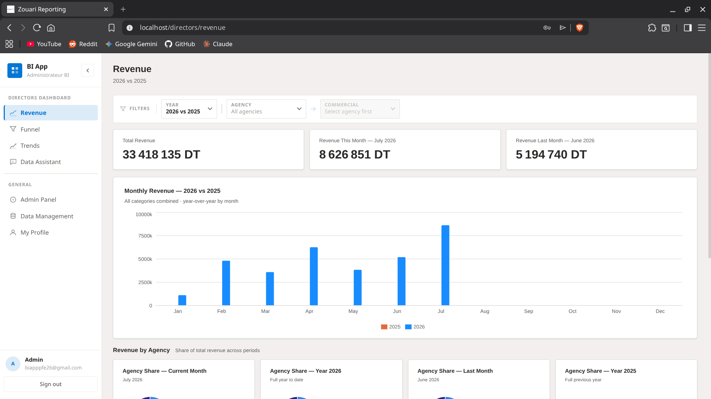
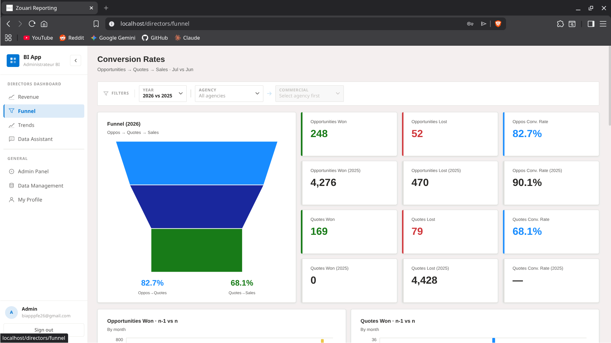
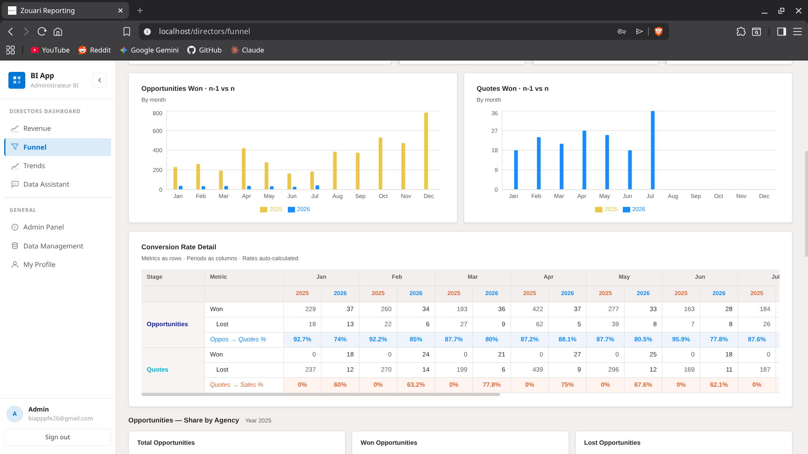
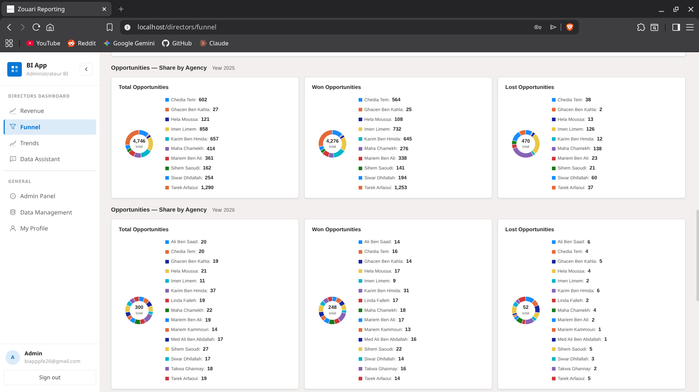
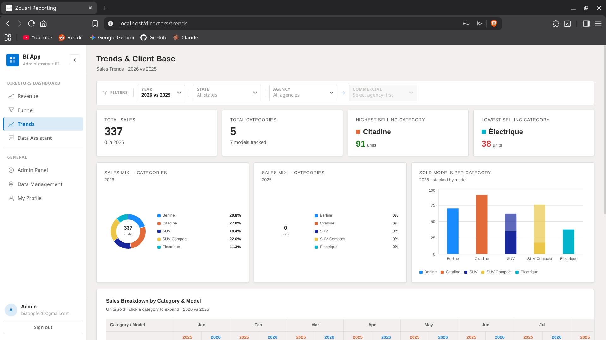
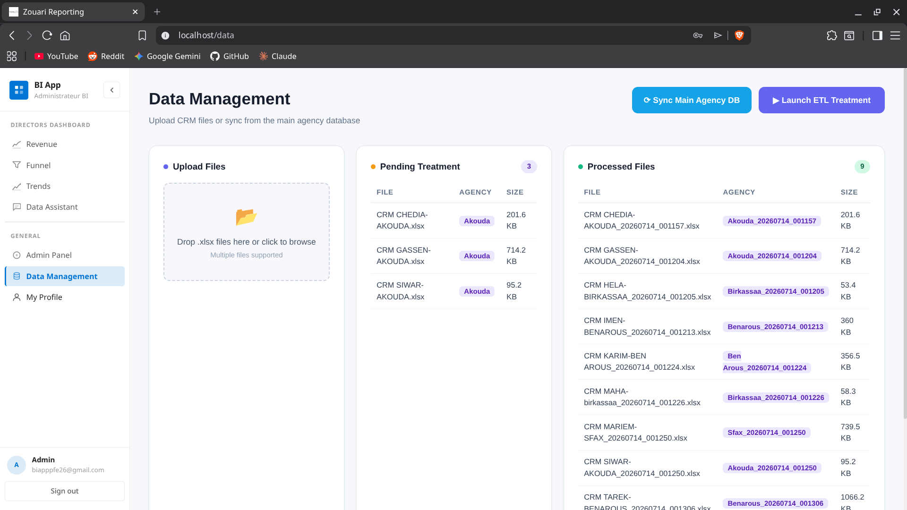
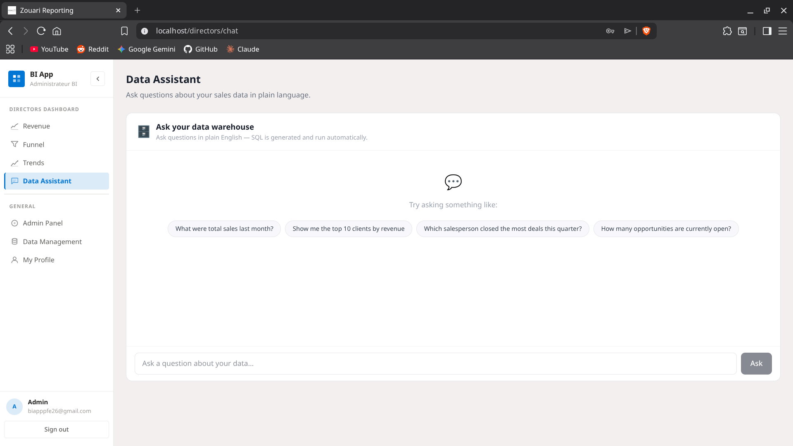

# Geely Business Intelligence Platform

**Final-year engineering project (PFE) — 2025/2026**

A full-stack Business Intelligence platform built for a Geely automotive dealership network in Tunisia, covering the entire chain from raw CRM exports to role-scoped analytical dashboards and a natural-language data assistant.

The dealership network runs several agencies, each exporting its own CRM data (opportunities, quotes, sales) as Excel files with no shared identifiers or consistent formatting. This project designs and implements the missing data layer: an ETL pipeline that validates and consolidates these exports into a proper data warehouse, and a web application that turns that warehouse into decision-making tools for management, agency managers, and sales staff.

> Built and owned end-to-end (schema design, backend, ETL, infrastructure) as part of a two-person team; a partner focused on dashboard/frontend development.

---

Final grade: **16.25/20**.

## Why this project

Car dealership networks like this one generate meaningful sales data, but it is scattered across per-agency Excel exports with no central source of truth — making even basic questions ("which agency is converting quotes into sales?", "how is a given salesperson performing this month?") slow to answer. This project's goal was to close that gap with a real, running system rather than a slide deck: a validated ingestion pipeline, a warehouse designed for analytical queries, and dashboards scoped to what each role is actually allowed to see.

---

## The data problem, and working with an incomplete brief

The company only provided raw CRM exports (opportunities and quotes) — there was no documented operational schema, and no sales data at all, since that part of the CRM export wasn't made available. Building a believable BI platform meant closing those gaps myself rather than waiting on data that wasn't coming:

- **Reverse-engineered an operational database schema** from the raw Excel structure, since none was supplied, then iterated on it across several design passes before it was solid enough to build the warehouse on top of.
- **Designed and generated realistic synthetic sales data** — including a full vehicle catalogue with plausible pricing — to fill the missing part of the funnel (won/lost quotes, final sale prices), so the dashboards would reflect a believable business rather than an empty one.
- Treated this as a normal part of the job rather than a blocker: figured out what was missing, researched approaches independently, and made a design decision instead of stalling on incomplete requirements. This same instinct led to adding the local LLM (Ollama) natural-language query assistant — a feature nobody asked for, added because it seemed like the right tool for the job once the warehouse existed.

---

## Architecture

```
 Excel exports (per agency)
          │  upload / validate
          ▼
 ┌─────────────────────┐        ┌──────────────────────────┐
 │   ETL Pipeline      │──────▶│  Data Warehouse(Postgres)│
 │   (Python, pandas)  │        │  star schema             │
 └─────────────────────┘        └──────────────┬───────────┘
          ▲                                    │
          │ scheduled sync (every 30 min)      │ SQL
 ┌─────────────────────┐                       ▼
 │ Operational DB      │              ┌─────────────────────┐
 │ (MS SQL Server)     │              │  FastAPI backend    │
 │ "Sage" ERP simulator│              │  role-scoped REST   │
 └─────────────────────┘              │  + JWT auth         │
                                      │  + NL→SQL AI chat   │
                                      └───────────┬─────────┘
                                                  │ JSON / axios
                                                  ▼
                                        ┌────────────────────┐
                                        │  React dashboard   │
                                        │  (Recharts, role-  │
                                        │  scoped views)     │
                                        └────────────────────┘
```

A more detailed request-lifecycle diagram (DWH → FastAPI → cache layer → React hooks → charts) is included in [`Useful_info/dashboard_data_flow.svg`](./Useful_info/dashboard_data_flow.svg), along with several other architecture diagrams generated while documenting the system for the jury.

---

## Key features

**Data ingestion & governance**
- ETL pipeline that parses multi-sheet Excel exports (`OP`, `DEVIS`, `SALES`), validates required columns per business rules, and rejects malformed files automatically instead of silently corrupting the warehouse.
- Deduplication and ID-resolution logic reconciling client/vehicle/user records across independently-produced agency files.
- Admin panel to upload files, trigger ETL runs, and inspect processed/rejected files without touching the server.
- Scheduled background sync (APScheduler) that periodically pulls the operational database into the warehouse.

**Data warehouse**
- PostgreSQL star schema (`dim_user`, `dim_client`, `dim_vehicle`, `fact_opportunities`, `fact_quotes`, `fact_sales`) designed specifically for the funnel and revenue queries the dashboards need, iterated across several PlantUML design passes.

**Backend (FastAPI)**
- JWT-based auth with four distinct roles (BI Admin, Marketing Director, Agency Manager, Commercial), each with a different data scope enforced server-side, not just hidden in the UI.
- Role-scoped REST endpoints (`/dashboard/global/*`, `/agency/*`, `/me/*`) for revenue, sales funnel, and trend analytics.
- A natural-language-to-SQL assistant (`/ai/query-dw`) backed by a local LLM (Ollama): translates plain-language questions into read-only SQL against the warehouse, with a query-safety guard, schema introspection, and automatic follow-up question suggestions.

**Frontend (React)**
- Role-specific dashboards (Director, Agency, Commercial) with revenue trends, sales funnels, geographic breakdowns, and drill-down filters (by agency, by commercial, by date range).
- Shared filter contexts and a lightweight request-caching layer to avoid redundant API calls as filters change.

**Infrastructure**
- Fully containerized with Docker Compose: SQL Server (operational DB simulator), PostgreSQL (warehouse), FastAPI, React/Nginx, and Ollama all spin up together.
- A pre-loaded warehouse image is published on Docker Hub so the app can be evaluated without manually generating data.

---

## Tech stack

| Layer | Technology |
|---|---|
| Frontend | React 19, Vite, Tailwind CSS, Recharts |
| Backend | Python, FastAPI, SQLAlchemy |
| Auth | JWT (python-jose), bcrypt/passlib |
| Data Warehouse | PostgreSQL (star schema) |
| Operational DB | MS SQL Server (simulates the dealership's Sage ERP) |
| ETL | Python, pandas, openpyxl / python-calamine |
| AI / NLP | Ollama (local LLM) for natural-language warehouse queries |
| Scheduling | APScheduler |
| Infrastructure | Docker, Docker Compose, Nginx |

---

## Data model

The warehouse uses a star schema optimized for the funnel (opportunity → quote → sale) and revenue analytics the dashboards run:

- **Dimensions:** `dim_user`, `dim_client`, `dim_vehicle`
- **Facts:** `fact_opportunities`, `fact_quotes`, `fact_sales`

Full DDL is available in [`PFE_2026/dwh.sql`](./PFE_2026/dwh.sql) and [`PFE_2026/OPDB.sql`](./PFE_2026/OPDB.sql).

---

## Running the project

The quickest way to see the whole system running is Docker Compose, which starts the operational DB, warehouse, API, frontend, and local LLM together:

```bash
docker compose up --build
```

- Frontend: http://localhost
- API + interactive docs: http://localhost:8000/docs

For local development without Docker (hot-reload on backend/frontend), see [`run_instructions.txt`](./run_instructions.txt).

A pre-loaded warehouse snapshot is also available, if you want data without running the ETL pipeline yourself:

```bash
docker pull elchaieb/pfe_dwh:latest
```

---

## Project structure

```
Backend/
├── app/                  # FastAPI app: routers, auth, models, scheduler
│   └── routers/
│       ├── auth.py           # login, user management
│       ├── admin.py          # file upload, ETL trigger, OpDB sync
│       ├── dashboard.py      # role-scoped analytics endpoints
│       ├── ai_analysis.py    # AI-assisted Excel validation
│       └── dw_chat_router.py # natural-language → SQL assistant
├── etl/
│   ├── pipeline/         # parsers + validators per data domain
│   └── opdb_sync/        # OpDB → DWH sync engine
└── Fake/                 # synthetic data generators for local dev

app_frontend/
└── src/
    ├── pages/            # Director / Agency / Commercial dashboards
    ├── components/       # filter contexts, charts, layout
    └── hooks/            # data-fetching hooks per dashboard metric

PFE_2026/                 # SQL DDL for the warehouse and operational DB
Useful_info/               # architecture & data-flow diagrams (SVG)
```

---

## Academic context

This project was developed as the final-year (PFE) capstone required to complete an engineering degree, with the goal of also supporting an application to master's programs. It was scoped, designed, and built as a production-shaped system rather than a toy exercise — including data validation, role-based access control, and containerized deployment — to reflect how this kind of platform would actually be run. It was defended in front of an academic jury and a company supervisor, and scored **16.25/20**.

---

## Skills developed

**Technical**
- End-to-end data warehouse design: dimensional (star schema) modeling, from PlantUML drafts to production DDL, for analytical rather than transactional workloads.
- ETL engineering: schema validation, defensive parsing of inconsistent real-world Excel exports, deduplication, and a scheduled sync engine between two live databases.
- Backend API design with FastAPI: role-based access control enforced at the query layer, JWT auth, and structuring analytics endpoints around what each dashboard actually needs.
- Practical use of a local LLM (Ollama) for a non-trivial task — natural-language-to-SQL — including schema introspection, prompt design, and guarding against unsafe generated queries.
- Frontend data-fetching patterns in React: shared filter contexts, request caching, and structuring dashboards around role-scoped data rather than one-size-fits-all views.
- Docker Compose orchestration of a multi-service system (two databases, an API, a frontend, and an LLM runtime) into a single reproducible environment.

**Soft skills**
- Independent problem-solving: given an incomplete data set and no operational schema, researched approaches on my own and made and justified design decisions rather than waiting for specification.
- Self-directed learning: picked up data warehousing, ETL design, and local LLM integration largely outside of coursework, driven by curiosity about how to solve the actual problem well rather than just adequately.
- Ownership: took full responsibility for backend, ETL, infrastructure, and data modeling as one half of a two-person team, coordinating scope with a partner handling the frontend/dashboards.
- Communicating technical tradeoffs to a non-technical jury and company supervisor, including documenting data lineage and architecture with diagrams built specifically for that audience.

---

## Screenshots

<p align="center">
  <p>Revenue Page:</p>
  
  
</p>

  <p>Funnel Page:</p>
  
  
  
</p>

<p align="center">
  <p>Trends Page:</p>
  
  
</p>

<p align="center">
  <p>Data Managment Page:</p>
  
</p>

<p align="center">
  <p>LLM Page:</p>
  
</p>


---

## Author

**Hamdi Chaieb** — [LinkedIn](https://www.linkedin.com/in/hamdi-elchaieb-162b5638b) · elchaiebhamdi@gmail.com
